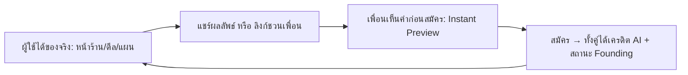

# Viral Growth Loop — CEO AI Thailand

> Playbook การเติบโตแบบไวรัลสำหรับ **AI Business Operating System** (ไม่ใช่ "ISO SaaS")
> เฟรมเวิร์กต้นทางเป็น B2B compliance loop — เอกสารนี้ **adapt เข้าจุดยืนจริง**: ช่วย SME
> *สร้างและเดินธุรกิจ* (MIT 24 Steps × ระบบบริหาร) · compliance = ฟีเจอร์เสริม ไม่ใช่แกนไวรัล
> แหล่ง canonical: [BRAND-ARCHITECTURE.md](BRAND-ARCHITECTURE.md) · เสริม [SUPERORGANISM-STRATEGY.md](SUPERORGANISM-STRATEGY.md) · [BLACK-HOLE-MARKETING.md](BLACK-HOLE-MARKETING.md)

---

## 0. ปรับกรอบก่อน: virality ของเรามาจากไหน (ไม่ใช่ supplier/auditor)

เฟรมเวิร์ก "ISO SaaS" ให้ไวรัลผ่าน **ซัพพลายเออร์/ผู้ตรวจประเมิน** เข้า audit workspace —
แต่ผลิตภัณฑ์เราไม่ได้ขาย compliance เป็นพระเอก. แกนไวรัลจริงของ CEO AI Thailand มี 3 เส้น:

| เส้นไวรัล | Trigger จริง | ใครถูกดึงเข้า |
|---|---|---|
| **Proof-led** (แกนหลัก) | ผู้ใช้ได้ "ของจริง" — แผนธุรกิจ/หน้าร้าน/ดีลแรก | เพื่อน SME ที่เห็นผลลัพธ์ |
| **Storefront/Marketplace** | เปิดร้าน `/b/<slug>` สาธารณะ → Google index + แชร์ | ลูกค้า + คู่ค้า B2B (RFQ) |
| **Referral (เครดิต)** | ชวนเพื่อน → ทั้งคู่ได้เครดิต AI จริง | เจ้าของธุรกิจอีกคน |

> หลัก: "virality ต้องเป็น *ส่วนหนึ่งของการใช้งาน* ไม่ใช่ของแถม" — สำหรับเรา output ที่ผู้ใช้
> ภูมิใจ (หน้าร้าน, แผน, โลโก้บริษัท AI) คือสื่อไวรัลโดยธรรมชาติ

---

## 1. Loop Blueprint (4 สเตจ) — เวอร์ชัน CEO AI Thailand

| สเตจ | หลักการ | ทำจริงในแอป |
|---|---|---|
| **Trigger / อารมณ์** | โมเมนต์ที่ผู้ใช้ *ได้คุณค่า* จนอยากอวด/ชวน | ปิดดีลแรก · หน้าร้านขึ้น Google · CEO AI เสนอชื่อ+โลโก้บริษัท · ผ่านขั้น MIT 24 |
| **Action / แชร์** | แชร์ง่ายไร้แรงเสียดทาน | ลิงก์ referral (`referralLink(wsId)`) · แชร์หน้าร้าน `/b/<slug>` · แชร์ผลลัพธ์ (การ์ดรูป) |
| **Conversion / เข้าร่วม** | ผู้รับได้เห็นค่าก่อนสมัคร | Instant Preview (พิมพ์ชื่อธุรกิจ → เห็นตัวอย่าง 60 วิ) → guest → สมัคร |
| **Reward / ฟีดแบ็ก** | ทั้งสองฝ่ายได้รางวัลที่ตรงคุณค่าแกน | เครดิต AI 200 calls/คน (จ่ายเมื่อเพื่อนสมัครจริง) + สถานะ Founding |



---

## 2. K-Factor & Retention — เป้าที่สมจริงสำหรับ B2B ไทย

`K = i × c` (i = จำนวนคำเชิญต่อผู้ใช้, c = อัตราแปลงต่อคำเชิญ) · net growth `G = K + R − 1`

- B2B SaaS ไทย **K ≥ 1 ยาก** — อย่าตั้งเป้าลวง. เป้าที่ใช้ได้จริง: **K 0.3–0.6 + R (retention 30 วัน) ≥ 0.4**
- เรตวัดจริงต้องมาก่อนการ optimize (ดู §6) — ตอนนี้ N=1 ยังไม่มี K วัดได้ → เก็บ funnel event ก่อน
- **Retention คือคันโยกที่คุ้มกว่า K ตอนนี้**: `nudge.ts` (เตือน trial/quota) + Welcome Kit + เมือง/streak
  = กัน "โตแล้วรั่ว" ก่อนไปเร่งไวรัล

---

## 3. PLG Triggers — map กับสิ่งที่ "มีแล้ว" vs "ช่องว่าง"

| PLG Principle | สถานะ | ของจริงในโค้ด |
|---|---|---|
| **Value before signup** | ✅ มีแล้ว | Instant Preview (`InstantPreview.tsx`) + guest mode + `/b/<slug>` สาธารณะ |
| **Self-serve onboarding** | ✅ มีแล้ว | GoalChooser + guided MIT 24 journey (ไม่ต้องที่ปรึกษา) |
| **2-sided referral** | ✅ มีแล้ว | `referral.ts` — 200 calls/คน, จ่ายเมื่อ referee สมัครจริง (anti-fraud ฝั่ง server) |
| **Founding / scarcity ซื่อสัตย์** | ✅ มีแล้ว | `founding.ts` — 1,000 คนแรก (100 แรก=ตลอดชีพ) |
| **Conversion nudge** | ✅ มีแล้ว | `nudge.ts` — เตือนตอน trial ≤3 วัน / quota ≥80% |
| **Welcome Kit (extrinsic)** | ✅ มีแล้ว | `welcomeKit.ts` — สมัคร→ปลด Skills (~฿3,000 มูลค่ารับรู้, ต้นทุน≈0) |
| **Built-in identity (watermark)** | ⛳ ช่องว่าง | หน้าร้าน/ผลลัพธ์ยังไม่มี "Made with CEO AI Thailand" + ลิงก์กลับ |
| **Aha-moment trigger** | ⛳ ช่องว่าง | ยังไม่ยิงคำชวน/แชร์ *ตอน* ผู้ใช้ได้คุณค่า (ดีลปิด/ร้านขึ้น) โดยอัตโนมัติ |
| **Shareable proof card** | ⛳ ช่องว่าง | ยังไม่มีการ์ดรูป (ผลลัพธ์/ badge) ให้แชร์ลง social ได้ 1 คลิก |
| **K-factor dashboard** | ⛳ ช่องว่าง | มี funnel events แต่ยังไม่มี invite→install→activate cohort |

> **สรุป: โครงไวรัล ~70% สร้างไว้แล้ว** — ที่ขาดคือ *ตัวจุดชนวน* (aha trigger) + *สื่อที่แชร์แล้วดึงกลับ*
> (identity/proof card) + *เครื่องวัด* (K dashboard)

---

## 4. Shareability by Design — 4 ช่องว่างที่ควรปิด (เรียงตาม ROI)

| ลำดับ | องค์ประกอบ | ทำอะไร | ต้นทุน | เหตุผล |
|---|---|---|---|---|
| 1 | **Aha-moment trigger** | เมื่อ `dealsClosed` เพิ่ม / storefront published → โชว์ CTA "ชวนเพื่อน (ทั้งคู่ได้เครดิต)" + "แชร์ร้าน" | ต่ำ (reuse referral) | จับจังหวะอารมณ์สูงสุด = แชร์เยอะสุด |
| 2 | **Built-in identity** | footer หน้าร้าน `/b/<slug>` ใส่ "⚡ สร้างด้วย CEO AI Thailand" + ลิงก์ `/start?ref=` | ต่ำมาก (แก้ server.ts/seo) | ทุกหน้าร้าน = โฆษณาถาวร (แบบ Canva/Typeform) |
| 3 | **Shareable proof card** | ปุ่ม "แชร์ผลลัพธ์" → การ์ด SVG/PNG (ชื่อบริษัท+โลโก้+เมตริก) ดาวน์โหลด/แชร์ | กลาง | social proof ที่มองเห็น = curiosity ของเพื่อน |
| 4 | **Pre-filled deep links** | ลิงก์ชวนมี UTM + ข้อความสำเร็จรูป (LINE/FB) | ต่ำ | ลดแรงเสียดทานการแชร์ |

---

## 5. Emotional Triggers — ผูกกับคุณค่าแกน (ไม่ dark pattern)

- **Status**: "บริษัท AI ของคุณโตระดับ …" (เมือง/level) · badge Founding Member
- **Reciprocity**: "ชวนเพื่อน — ทั้งคู่ได้เครดิต AI 200 calls" (ของจริง จ่ายเมื่อเพื่อนสมัคร)
- **Belonging**: "ชวนหุ้นส่วน/ทีมเข้ามาทำแผนเดียวกัน" (workspace)
- **Curiosity/FOMO ที่ซื่อสัตย์**: "เหลือที่นั่ง Founding อีก N ที่" (นับจริงจาก server ไม่ปลอม)
- **Utility**: ทำงานร่วม/ติดตามธุรกิจด้วยกัน

> ⚠️ ยึดจริยธรรมแบบเดียวกับหน้า Pulse: opt-in · ตัวเลขจริง · ห้าม scarcity ปลอม/สแปม

---

## 6. วัดผล & ทดลอง — ต้องมาก่อน optimize

Funnel: `invite_sent → invite_opened → signup → activated → retained`

- Metrics: invite→signup rate, activation (ทำขั้น MIT/เปิดร้าน/ปิดดีล), retention 30 วัน, viral cycle time
- ต่อยอดจาก `analytics.ts` (มี funnel events แล้ว) + `experiments.ts` (A/B ที่ซื่อสัตย์)
- A/B ที่ควรลองก่อน: ข้อความชวน · จังหวะยิง trigger (ตอนปิดดีล vs หลังใช้ครบ 7 วัน) · รางวัล
- Query cohort (Supabase) เมื่อมี volume:
  ```sql
  -- invite→activate + cycle time (เมื่อมี referral events จริง)
  select
    count(*) filter (where activated) ::float / nullif(count(*),0) as conv_rate,
    avg(activated_at - invited_at) as cycle_time
  from referral_events;
  ```

---

## 7. Network Effects — ชั้นที่ทำให้ "ยิ่งคนเยอะยิ่งมีค่า"

- **Marketplace network**: ร้าน/skill เยอะ → ผู้ซื้อเจอของมากขึ้น → ดึงผู้ขายใหม่ (ดู `interCityTrade`, RFQ)
- **Content network**: หน้าร้าน `/b/<slug>` + case studies = SEO ที่ดึง organic (ดู BLACK-HOLE)
- **Data/benchmark network** (อนาคต): ยิ่งมีธุรกิจ → benchmark KPI แม่นขึ้น (คุณค่าเพิ่มต่อผู้ใช้ใหม่)

---

## 8. Ethical & Sustainable (ตรงกับ DNA แบรนด์)

- แชร์แบบ **opt-in** เท่านั้น — ไม่ auto-สแปม contact
- รางวัลโปร่งใส จ่ายเมื่อมีรายได้จริง (`referral` = จ่ายเมื่อ referee เป็นแพ็กจ่ายเงิน) → ไม่เจ็บมาร์จิน
- โฟกัส retention + reputation ระยะยาว มากกว่า vanity K

---

## 9. แผนลงมือ (เสนอ — ยังไม่เขียนโค้ด รอเลือก)

**เฟส A — ปิดช่องไวรัลที่ ROI สูงสุด (ต้นทุนต่ำ, reuse ของที่มี):**
1. Aha-moment trigger: hook `dealsClosed`/storefront published → การ์ด CTA "ชวนเพื่อน + แชร์ร้าน" (reuse `referralLink`)
2. Built-in identity: footer หน้าร้านสาธารณะ "⚡ สร้างด้วย CEO AI Thailand" + `?ref=`

**เฟส B — สื่อไวรัล + การวัด:**
3. Shareable proof card (SVG/PNG โปรซีเจอรัล — เข้าธีม เหมือน companyIdentity logo)
4. K-factor / referral cohort dashboard (ต่อจาก analytics funnel)

**เฟส C — เมื่อมี volume:** A/B ข้อความ/จังหวะ/รางวัล (ผ่าน `experiments.ts`)

> เริ่มที่ **เฟส A ข้อ 1–2** ได้ทันที (ต้นทุนต่ำ ผลชัด) — สั่งได้เลยถ้าจะให้ลงมือ
